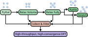

Background
==========

Unlike molecular dynamics-based methods, which sample configurations along thermodynamic paths from a starting structure, this approach generates initial structures by random parametrization of crystallographic symmetry groups, requiring no pre-existing interatomic potential.
The training set thereby covers broad regions of the potential energy surface independently of any specific target phase or thermal condition.

The training strategy to achieve this splits in three steps:

1. the exploration of the PES with randomly generated, but symmetric, periodic crystals in 
:ref:`assyst.crystals <crystals>`;

2. locating energetically favorable pockets in the PES by relaxing the initially generated sets of structures in
:ref:`assyst.relaxations <relaxations>`, this can be done in multiple steps;

3. exploring the direct neighborhood of these pockets by perturbing the relaxation configurations again in
:ref:`assyst.perturbations <perturbations>`.

These three steps are then combined and filtered based on configurable criteria to avoid unreasonable structures.

This is illustrated in :ref:`below <schematic>`, with the steps 1-3 arranged on top in green, and the filtering step in
red.
The final step is labelling the structures with high quality DFT, which is outside of the scope of this package.

ASSYST automatically assigns each structure a unique identifier and records its full derivation history as it passes
through the workflow steps above.
See :doc:`metadata` for an overview of what is tracked.

.. _schematic:

   ASSYST workflow steps. Reproduced from `Poul et al. <https://doi.org/10.1038/s41524-025-01669-4>`_ under
   `CC-BY 4.0 <https://creativecommons.org/licenses/by/4.0/>`_ license.
