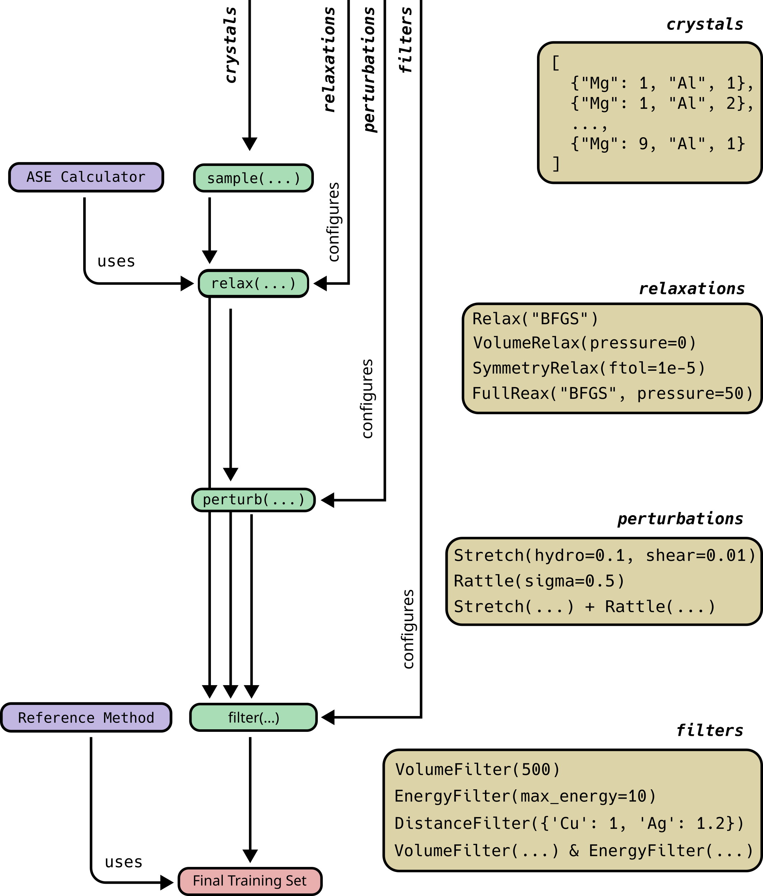

# Summary

The accuracy of machine-learning interatomic potentials (MLIPs) depends
on high-quality training data, yet existing automation tools are often
monolithic and tied to specific electronic-structure codes. ASSYST is a
lightweight, pure Python library that implements the Automated Small
Symmetric Structure Training method. It has a modular design: small,
orthogonal classes communicate via abstract interfaces and the Atomic
Simulation Environment (ASE) Calculator API. The package can be easily
integrated with workflow managers (e.g. executorlib[@executorlib] and
pyiron[@pyiron]), a command-line interface (CLI) or a graphical user
interface (GUI), enabling heterogeneous high-performance computing (HPC)
deployment. Released under the BSD3 licence with full documentation and
CI testing, ASSYST enables the flexible and extensible generation of
MLIP training data across diverse research workflows.

# Statement of Need

Generation of training data is the leading expense in developing new
interatomic potentials, both in terms of compute time as well as human
interaction. Various approaches have been developed to automate this
task via active learning, though the resulting code bases are often
specific to certain MLIPs and particular applications. This complicates
both the comparison of methods across models and systems and the
construction of foundational datasets that confer wide transferability
on their MLIPs.

Recently, we developed a method, the *Automated, Small, Symmetric,
Structure Training* or *ASSYST*. It produces training sets consisting of
large numbers of small supercells, remaining agnostic to the MLIP
architecture used to train on the generated data while yielding
exceptionally transferable MLIPs.[@poul23; @poul25] Meanwhile, the field
is rapidly advancing: universal MLIPs now model significant parts of the
entire periodic table[@grace], extended formalisms handle additional
degrees of freedom beyond geometry[@yang2026macro]; and new reference
data expand the scope of
potentials.[@schran2019automated; @herzog2024coupled] All of these
developments hint strongly that much more and high quality training data
will be required in the near future, generated and ingested by new data
sources and new MLIP architectures, that are difficult to foresee.
*ASSYST* therefore targets a design that facilitates the
interoperability with different (*electronic*) reference data, MLIPs, or
workflow managers.

# State of the Field {#stateoffield}

There exist multiple software packages that aim to generate training
data for MLIPs (and often the MLIPs themselves, too), offering
integrated workflows to do so automatically or semi-automatically, e.g.
[@gelzinyte23; @ZengDeepMD; @autoplex; @pymatnest] aimed at solid state
materials. All of these packages are deeply integrated with the software
required to run the underlying electronic structure calculations and
MLIP fitting. While this can be convenient, it also makes setting up
additional MLIPs or electronic data generation methods very difficult.

By comparison, *ASSYST* aims to be more compact and easier to extend,
and to be less dependent on certain reference data or MLIPs. The
integration of *ASSYST* has been demonstrated in multiple public
workshops. [@dpg2025; @dpg2026] In the supporting material of these
workshopse, we demonstrated the ease of integration with existing
workflow tools, MLIP codes, and a GUI---something that would be
cumbersome to implement with other CLI-based tools.

# Software Design and Features

This package is the result of a refactoring of a previous implementation
of the method.[@potentialfit] The previous implementation followed an
integrated design pattern, similar to alternative packages mentioned
above. However, on attempting to integrate that previous code with
workflow tools and execution
models[@pyiron_core; @pyiron_workflow; @executorlib] we found difficulty
in cleanly expressing all options and capabilities of a monolithic code
in these smaller and more flexible contexts without a lot of code
duplication. Hence, we redesigned *ASSYST* from scratch by relying on:

1.  small, orthogonal classes, and

2.  clean, abstract interfaces between them.

The result is lightweight code that can be quickly integrated into other
packages, even without in-depth knowledge of the code base. Users on
High Performance Computers can benefit from this particularly because
the individual steps of a workflow producing an MLIP require quite
different and heterogeneous compute resources. Initial preparation tasks
may require minimal parallelisation, if any, whereas electronic
structure calculations are almost always heavily optimised across
multiple compute nodes. Fitting the MLIP on the other hand is often best
done on specialized GPU-accelerated nodes. In a loosely-coupled code
like *ASSYST*, users therefore have a large flexibility to submit
different parts of the workflow to the best fitting HPC resources, e.g.
with [@executorlib].

This flexibility is also crucial to future-proof the package to changes
in MLIP architecture or reference data. `assyst` will require very few
or no changes to deal with other MLIPs or data, while more monolithic
designs, e.g. in [\[stateoffield\]](#stateoffield){.ref} are likely to
require more modifications.

In [\[fig1classes\]](#fig1classes){.ref}, we show the program design
that enables the flexibility. Green boxes show individual workflow
steps. Between them data flows as lists of ASE[@ase-paper] `Atoms`
objects. `Atoms` are a well-known and widely used data structure in
computational materials science that enables the easy distribution of
the individual workflow steps. In our previous GUI implementations
[@dpg2025; @dpg2026], each of the boxes is represented by an interactive
'window" or 'node'. The ochre-colored boxes highlight possible and
common configuration options for each step, e.g. passing
`VolumeRelax("BFGS", pressure=0)` will instruct `relax(...)` to minimize
the energy of each structure at zero pressure using the well-known BFGS
algorithm. The violet boxes in turn show where in the workflow `ASSYST`
relies on external codes to generate reference data or as a force
engine. These interactions are either via the widely employed ASE
Calculator interface or can be realized by overloading a minimal set of
documented methods, which naturally integrate into the main workflow.

Finally, where *ASSYST* relies on random initialization or perturbation,
the state of the underlying random number generators is exposed to
enable fully reproducible runs. Each generated structure is assigned an
ID and the relationship of derived structures is tracked. Both together
enable to verify the data provenance of the each data point in a
training set. This property is included in the test suite.

<figure>

<figcaption>
Outline of data and control flow in the package. Green
boxes are the cleanly separated workflow steps. Arrows among them show
the flow of generated structures. Ochre boxes show example code of the
small modular classes that are used to configure the individual workflow
steps. Violet boxes show the locations where <em>ASSYST</em> loosely
couples to external codes.
</figcaption>
</figure>

[]{#fig1classes}

# Research Impact Statement

*ASSYST* implements a recent and novel method to generate training data
that we described in detail in [@poul23; @poul25]. While this
implementation was not used in the original publication, those papers
prompted multiple independent
investigations[@ito25; @bienvenue25; @brunner26] using derived training
sets, so that we believe a unified and easily extended implementation
will be helpful. *ASSYST* has been used in multiple, public teaching
workshops.[@dpg2025; @dpg2026]

# Documentation and Source Code

Documentation include worked examples in notebooks is available at
<https://assyst.readthedocs.io/stable>. The source code can be obtained
under BSD 3-clause license at
<https://github.com/eisenforschung/assyst>.

# AI Usage Disclosure

Generative AI was used to generate the tests, parts of the
documentation, and a small number of features. The majority of AI
contributions are clearly marked as such by the commit information as
authored by `google-labs-jules[bot]`[@jules],
`Claude <noreply@anthropic.com>` or `github-bot[bot]`.
`jules` was used with Gemini 2.5[@gemini_2_5] and 3[@gemini_3_pro], for
`Claude` we used Sonnet 4.6[@claude_sonnet_4_6] and Opus
4.6[@claude_opus_4_6] and 4.7[@claude_opus_4_7]. Prompts are linked in PR descriptions where
applicable. Additionally, most of the test suite was generated and
committed manually in early commits. We ensured high quality by manual
revision of all generated code and documentation. These revisions were
done openly on GitHub comments and can be transparently reviewed in the
corresponding pull request comments. The architecture of the package has
been entirely designed by us, and the clean and orthogonal design
supports the safe use of AI because it enables small localized changes
that are easily reviewed by human eyes.

# Acknowledgements

MP and JN acknowledge funding from the Deutsche Forschungsgemeinschaft
(DFG, German Research Foundation) through the Collaborative Research
Center 1394 (SFB 1394, No. 409476157).
